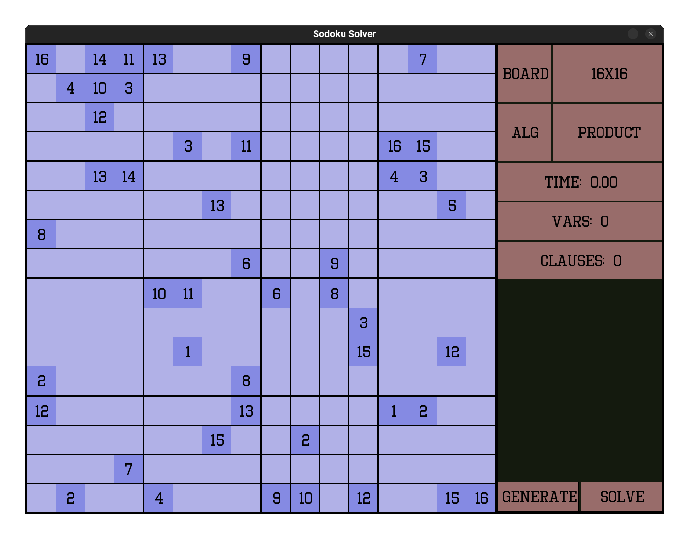

# Sodu
A sodoku solver using sat encoding

# Build
> Requires sdl2 installed. Get it with your package manager

> Only test on Linux, i don't have a Window machine and install SDL2 on Windows is so much harder.
```
git clone https://github.com/ppvan/sodu
git init
git submodule update

./build.sh && ./build/main.out
```

# Preview


